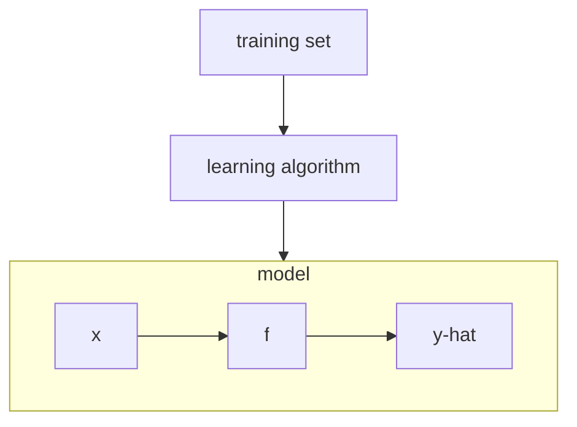

# Week 1: Supervised Machine Learning: Classification and Regression

## Supervised vs. Unsupervised Machine Learning

### What is Machine Learning?

 > "Field of study that gives computers the ability to learn without being explicitly programmed" - Arthur Samuel (1959)

- In general the more opportunities you give a learning algorithm to learn, the better it will perform.
- Types of machine learning algorithms:
  - Supervised Learning 
  - Unsupervised Learning
  - Recommender Systems 
  - Reinforcement Learning

### Supervised Learning: part 1

- Supervised learning: 
  
  ```mermaid
  flowchart LR
  subgraph input;
  X;
  end;
  subgraph output;
  Y;
  end;
  input --> output;
  ```

- You can train the model by giving it, correct output labels (Y) for every input (X), such that for an unknown input X_1 the algorithm can give a fairly accurate output label Y_1.
- Two main types of Supervised learning:
  - Regression
  - Classfication
- Regression alogorithm: predict the output value from infinitely many possible output values based on input features from the data fed in the system.
  - eg. price of house prediction.

### Supervised Learning: part 2

- Classification algorithm: categorizes a set of data into classes
  - eg. breast cancer detection: tumor is malignant vs. benign
  - Difference from regression: classification predicts small number of possible outputs but not all possible numebers like regression 
- For two or more inputs, you can find a line of separation/boundary

### Unsupervised Learning: part 1 

- Unsupervised Learning: Algorithms to find patterns in the unlabeled data.
- Clustering algorithm: unsupervised learning algorithm to group unlabeled data into clusters.
  - eg. Google news to group related news articles together.
  - eg. Clustering DNA microarray data
  - eg. Grouping customers into different market segments 

### Unsupervised Learning: part 2 

- Unsupervised learning: data only comes with inputs x, but not output labels y.
  - Algorithm has to find structure in the data 
- Types of Unsupervised learning:
  - Clustering- Group similar data together.
  - Anomaly Detection- Find unusual data points.
  - Dimensionality reduction- Compress data using fewer numbers.

## Regression Model

### Linear Regression Model: part 1

- Type of supervised learning
  - predicts a number
- Linear regression technique finds out a linear relationship between a dependent variable and the other given independent variables (fit a striaght line to the data).
- Terminology:
  - Training set- data used to train the model 
    - x = input variable fearure
    - y = output/target variable
    - m = total number of training examples
    - (x, y) = single training example

### Linear Regression Model: part 2



- How to represent *f*
   - $\hat{y}^{(i)} = f_{w,b}(x^{(i)}) = wx^{(i)} + b$
   - This is Linear regression with **one** variable/ **Univariate** linear regression

### Cost Function Formula

- Model: $ f_{w,b}(x) = wx + b $
- $ w,b $ : *parameters, coefficients, weights* -  variables you can adjust during training in order to improve the model
- How do you find values for $w,b$ such that $\hat{y}^{(i)}$ is close to $y^{(i)}$ for all $(x^{(i)}, y^{(i)})$
- Cost function will be sued to determine how well a line fits the training data 
  - error = $(\hat{y}^{(i)}- y^{(i)})$ 
  - $m$ = number of training samples  
  - **Cost function**: Squared error cost function 
  $$ J{(w,b)} = \frac{1}{2m} \sum_{i=1}^{m}(\hat{y}^{(i)}- y^{(i)})^2 $$ 
  $$ J{(w,b)} = \frac{1}{2m} \sum_{i=1}^{m}(f_{w,b}(x^{(i)})- y^{(i)})^2 $$ 

### Cost Function Intuition

- General case goal: minimize $ J(w,b) $
- simplified model: m
  $$ f_{w}(x) = wx $$
  $$ b = 0 $$
  $$ J{(w)} = \frac{1}{2m} \sum_{i=1}^{m}(f_{w}(x^{(i)})- y^{(i)})^2 $$ 
  - goal: minimize $J(w)$
  - $f_w(x)$ => for fixed w, function of $x$
  - $J(w)$ => function of $w$
  - When the cost is relatively small, closer to zero, it means the model fits the data better compared to other choices for $w$ and $b$

### Visualizing the Cost  Function

- General case goal: minimize $ J(w,b) $
- model:
  - $f_w(x)$ => function of $x$
  - $J(w)$ => function of $w,b$

### Gradient Descent 

- GD optimization algorithm which is commonly used to train machine learning models and neural networks
  - example: for linear regression cost functions or any function 
- Overview 
  - function $J(w,b)$
  - Want $min_{w,b}J(w,b)$
  - If you have 
  $$J(w_1,w_2,...,w_n,b)$$
  - objective 
  $$min_{w_1,w_2,...,w_n,b} J(w_1,w_2,...,w_n,b)$$
  pick values $w_1,w_2,...,w_n,b$ that gives you smallest value of $J$
- Outline
  - Start with some $w,b$
  - Keep changing $w,b$ to reduce $J(w,b)$
  - Until we settle at or near a minimum
    - for some functions $J$, it is possible to have more than one minimum (local minima)

### Implementing Gradient Descent

- Gradient Descent alogorithm
  - $\alpha$ = learning rate
  - $w = w - \alpha \frac{\partial}{\partial{w}}J(w,b)$
  - $b = b - \alpha \frac{\partial}{\partial{b}}J(w,b)$ 
  - Keep on updating $w,b$ until they do not change/ very small change
- Corect: Simultaneous update
  - *tmp_w* $= w - \alpha \frac{\partial}{\partial{w}}J(w,b)$
  - *tmp_b* $= b - \alpha \frac{\partial}{\partial{b}}J(w,b)$
  - *w = tmp_w*
  - *b = tmp_b*
  - **Note**: do not update w with tmp_w before calculating tmp_b

### Gradient Descent Intuition

- derivative term determines "direction" (postive or negative slope) to change values of $w$ and/or $b$ to take you closer to the value of $w$ and/or $b$ where $J$ is minimum

### Learning Rate 

- If $\alpha$ is too small 
  - Gradient descent may be slow
  - Decrease to cost function is very slow/ lot of iterations 
- If $\alpha$ is too large 
  - Gradient descent may fail to converge; some cases diverge
  - Change to cost function is steep, never reach minimum
- In some cases, when GD reaches a local minima
  - Next iteation of GD does not take place as slope a local minima is 0
    - $ \alpha \frac{\partial}{\partial{w}}J(w) = 0$
  - As we reach a local minima, GD will automatically keep taking smaller steps 
    - Derivative becomes smaller
    - Update steps become smaller 

### Gradient Descent for Linear Regression

- Linear Regression model:
$$ f_{w,b}(x) = wx + b $$
- Cost function:
$$ J{(w,b)} = \frac{1}{2m} \sum_{i=1}^{m}(f_{w,b}(x^{(i)})- y^{(i)})^2 $$
- Gradient descent algorithm: 
  repeat until convergence { 
$$ w = w - \alpha \frac{\partial}{\partial{w}}J(w,b)$$
$$b = b - \alpha \frac{\partial}{\partial{b}}J(w,b)$$
- update $w$ and $b$ **simultaneously** at each step
- derivative term for linear regression with squared error cost function
  - $\frac{\partial}{\partial{w}}J(w,b) = \frac{1}{m}\sum_{i=1}^{m}(f_{w,b}(x^{(i)}- y^{(i)})x^{(i)}$
  - $\frac{\partial}{\partial{b}}J(w,b) = \frac{1}{m}\sum_{i=1}^{m}(f_{w,b}(x^{(i)}- y^{(i)}) $
- for squared erro cost function thaere will always be 1 global minimum (no local minima) due to "bowl" shape of function (convex function)

### Running Gradient Descent

- "Batch" gradient descent
  - Each step of gradient descent uses all the training examples 